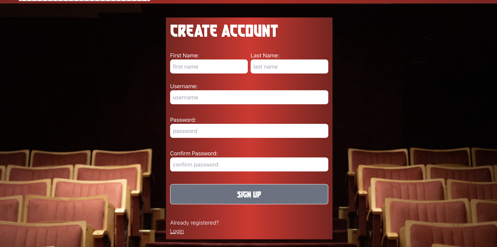
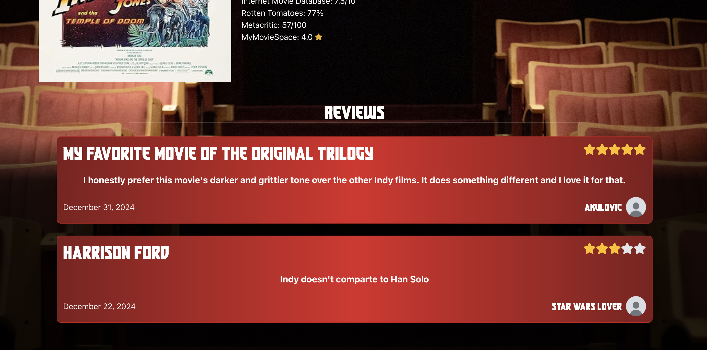
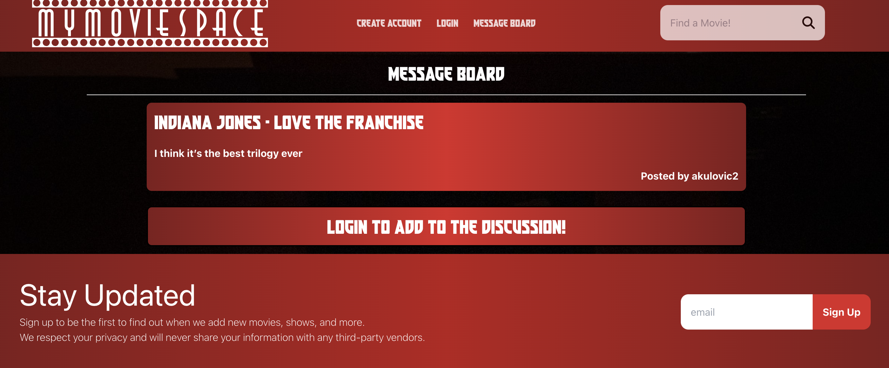

# MyMovieSpace2
MyMovieSpace is a website where you can search for your favorite movies, bookmark or add to your watched list. You can also contribute to discussions about movies with other users.

## Built With

React\
Nodejs\
Mongoose\
MongoDB\
MongoDB Atlas\
Tailwinds CSS\
JavaScript\
CSS\
HTML

## Search your favorite movies!
With our website you can search for any of your favorite movies, newly released ones and the classics!

## Signup for Added Features
We highly suggest you signup to our website! With an account you can add posts about movies, leave reviews, and view your bookmarked and watched movies in your profile! You can also update your profile picture with a fun collection of profile photos.

## Leave Reviews
Make sure to leave reviews for others to see. You can write a description about your thoughts on the movie and leave a star rating!

## Post your movie discussions
Leave a post on any movie topic you want to talk about. Other users will see your post and can comment. Users can also leave replies to those comments to add to the discussion!

## Link

[MyMovieSpace](https://my-movie-space-9d82abf6cb80.herokuapp.com/)